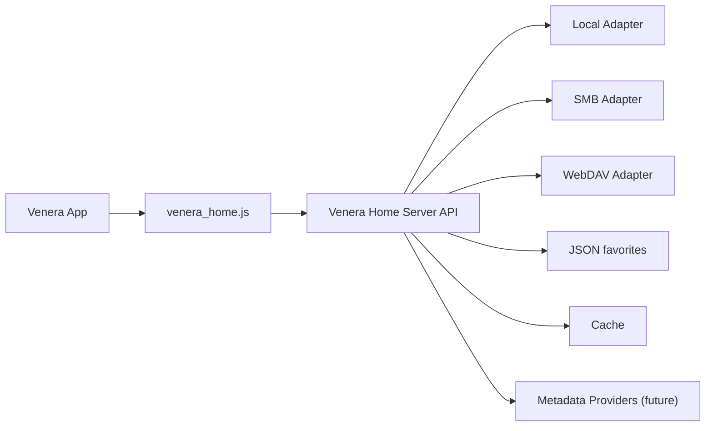

# Venera Home Architecture

`Venera Home` is an implemented local-library solution for Venera based on a lightweight HTTP server and a thin Venera source script.

## Goals

- Read comics already stored on local disks, SMB shares, or WebDAV.
- Keep the Venera source implementation simple and aligned with the existing template APIs.
- Move filesystem, archive, metadata, cache, and remote protocol complexity into a standalone server.
- Start with an offline-first design and leave room for future metadata fetching from internet providers.

## Folder Contents

- `openapi.yaml`: initial HTTP API contract for the home server.
- `server.example.toml`: example server configuration covering local, SMB, and WebDAV libraries.
- `venera_home.js`: canonical Venera source script mapped to the proposed API.
- `使用指南.md`: end-user setup guide.

In the monorepo layout, a synced distribution copy also lives at `..\venera_home.js` for direct inclusion in `venera-configs`.

## Recommended Shape

- Server language: Go
- Server storage: JSON favorites store + filesystem cache
- Source transport: HTTP JSON APIs + pre-signed image URLs
- Auth: single-user Bearer token

## Architecture



## Scope

### MVP

- Local, SMB, and WebDAV libraries
- Folder-image comics and `cbz`/`zip`, `cbr`/`rar`, `cb7`/`7z`, and `pdf`
- Scan, index, home feed, category browsing, search, comic details, chapter reading
- Favorites with multiple folders
- `ComicInfo.xml` and `.venera.json` metadata override support
- Cover, archive, and PDF page cache
- Manual rescan endpoint

### Later

- Metadata refresh jobs
- Internet metadata providers
- Optional web admin page

## Venera API Mapping

| Venera source API | Home server endpoint |
| --- | --- |
| `init()` | `GET /api/v1/bootstrap`, `GET /api/v1/categories` |
| `explore.load()` | `GET /api/v1/home` |
| `category.parts[].loader` | cached `GET /api/v1/categories` result |
| `categoryComics.load()` | `GET /api/v1/comics` |
| `search.load()` | `GET /api/v1/search` |
| `favorites.loadFolders()` | `GET /api/v1/favorites/folders` |
| `favorites.addFolder()` | `POST /api/v1/favorites/folders` |
| `favorites.deleteFolder()` | `DELETE /api/v1/favorites/folders/{folder_id}` |
| `favorites.loadComics()` | `GET /api/v1/favorites/comics` |
| `favorites.addOrDelFavorite()` | `POST /api/v1/favorites/items`, `DELETE /api/v1/favorites/items` |
| `comic.loadInfo()` | `GET /api/v1/comics/{comic_id}` |
| `comic.loadThumbnails()` | `GET /api/v1/comics/{comic_id}/thumbnails` |
| `comic.loadEp()` | `GET /api/v1/comics/{comic_id}/chapters/{chapter_id}/pages` |

## Data Priorities

Recommended metadata precedence:

1. Manual override sidecar such as `.venera.json`
2. Embedded metadata such as `ComicInfo.xml`
3. Parsed metadata from filenames and directory structure
4. Future remote provider metadata

## Suggested Server Layout

```text
cmd/
  venera-home-server/
internal/
  adapter/
    local/
    smb/
    webdav/
  api/
  archive/
    dir/
    zip/
    rar/
    sevenzip/
    pdf/
  cache/
  config/
  db/
  metadata/
  scanner/
```

## Notes

- The source script is intentionally thin. It should mostly map server JSON into Venera `Comic` and `ComicDetails` objects.
- Image URLs are assumed to be pre-signed so covers and pages can load without extra custom header handling.
- If the server later switches to strict header-only auth for images, `comic.onImageLoad()` and `comic.onThumbnailLoad()` are the right extension points.
