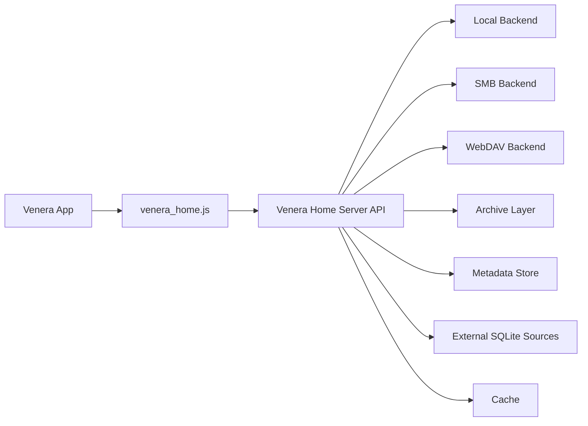

# Venera Home Server

[中文](./README.md) | [English](./README_EN.md)

`Venera Home Server` 是为 **[Venera](https://github.com/venera-app/venera)** 准备的本地漫画后端服务。它会把本地磁盘、SMB、WebDAV 中的漫画统一暴露成轻量 HTTP API，并配套提供可直接导入 Venera 的 `venera_home.js`。

除了基础阅读能力外，当前版本已经内置一套 **手动触发、自动应用** 的本地元数据补全流程：

- 扫描时把漫画条目写入本地元数据库
- 从 `data/externaldb` 自动发现外部 SQLite 数据源
- 在 Web 管理页中手动触发补全任务
- 自动把命中的元数据写回本地库
- 任务结束后自动 `Rescan`，让 Venera 侧马上看到结果

## 项目目标

- 让 [Venera](https://github.com/venera-app/venera) 直接读取你已经拥有的漫画
- 把文件系统、归档读取、缓存、元数据处理沉到独立服务端
- 保持 `venera_home.js` 尽量薄，主要负责 API 映射
- 优先覆盖离线 / 私有漫画库场景，同时为后续更多数据源留扩展空间

## 当前能力

### 书库来源

- 本地目录
- SMB 共享（当前仅 Windows 实现）
- WebDAV

### 支持格式

- 图片目录：`jpg` / `jpeg` / `png` / `webp` / `gif` / `bmp` / `avif`
- ZIP 类压缩包：`cbz` / `zip`
- RAR 类压缩包：`cbr` / `rar`
- 7-Zip：`cb7` / `7z`
- 文档：`pdf`（当前仅 Windows 渲染）

### 阅读与服务能力

- 扫描、索引、首页、分类、搜索、详情、章节阅读
- 收藏夹与多文件夹收藏
- `ComicInfo.xml` 读取
- `.venera.json` 手工覆盖元数据
- 归档与远程文件缓存
- PDF 首次访问按页渲染并缓存
- 手动重扫
- 带签名的封面 / 页面媒体 URL

### 元数据能力

- 扫描结果持久化到本地 `metadata.db`
- 扫描时自动记录匹配 hint、路径、指纹等信息
- 支持“填空式”合并：远程补全不会覆盖已有本地显式元数据
- 支持本地外部 SQLite 数据源补全
- 支持 dry-run 匹配分析工具 `exdb_dryrun`
- 支持在管理页中执行：
  - 手动批量补全
  - 单条重试补全
  - 锁定 / 解锁某条记录
  - 重置为仅保留本地元数据
  - 浏览外部数据源内容

### 管理页

服务启动后，根路径 `/` 即为内置 Web 管理页。

当前页面支持：

- 查看任务进度
- 查询本地元数据记录
- 触发手动补全
- 浏览 `data/externaldb` 下的数据源
- 对单本执行锁定、解锁、重置、单条补全

## 当前限制

- `SMB` 当前只在 Windows 构建中可用
- `PDF` 当前只在 Windows 构建中可用，依赖系统内建 `Windows.Data.Pdf`
- 当前补全数据源是 **本地 SQLite**，还没有接入互联网元数据源
- 当前没有自动计划任务；补全需要你手动触发
- 当前没有复杂的冲突审查流；设计目标是“手动触发一次 + Web 中做基础纠正”

## 仓库结构

- `main.go`：项目入口，可直接 `go run .`
- `app/`：核心应用模型、扫描流程、元数据合并、补全任务
- `httpapi/`：HTTP API、媒体分发、管理页、页面缓存
- `metadata/`：本地元数据存储与查询
- `exdbdryrun/`：外部 SQLite 匹配与 dry-run 逻辑
- `backend/` / `archive/`：存储后端与归档读取
- `tests/`：测试模块与 `testkit/`
- `venera_home.js`：Venera 源脚本
- `server.example.toml`：示例配置
- `openapi.yaml`：HTTP API 草案

## 架构概览



## 快速开始

### 1. 准备配置

从下面文件复制一份并修改：

- `server.example.toml`

最小本地示例：

```toml
[server]
listen = "0.0.0.0:34123"
token = "change-me"
data_dir = "./data"
cache_dir = "./cache"
memory_cache_mb = 512
log_level = "info"

[scan]
concurrency = 4
extract_archives = true
watch_local = false
rescan_interval_minutes = 30

[metadata]
read_comicinfo = true
read_sidecar = true
allow_remote_fetch = false

[[libraries]]
id = "local-main"
name = "Local Manga"
kind = "local"
root = "D:/Comics"
scan_mode = "auto"
```

说明：

- `log_level` 默认是 `info`；如果你想看缓存、预取、扫描细节，可改成 `debug`
- `scan_mode`：
  - `auto`：默认；只有同层目录 / 归档的显式元数据能对应上时，才会合并成同一漫画的多章节
  - `flat`：不自动合并；每个目录或压缩包都按独立漫画处理
- `allow_remote_fetch` 当前还主要是为未来互联网数据源预留的开关

### 2. 如果使用 SMB / WebDAV，先配置密码环境变量

```powershell
$env:SMB_PASS = "your-password"
$env:WEBDAV_PASS = "your-password"
```

### 3. 启动服务

开发模式：

```powershell
go run . -config ./server.example.toml
```

如果你已经有编译好的程序：

```powershell
.\venera_home_server.exe -config .\server.example.toml
```

### 4. 在 Venera 中导入源脚本

导入：

- `venera_home.js`

然后填写：

- `Server URL`：例如 `http://127.0.0.1:34123`
- `Token`：与服务端配置保持一致
- `Default Library ID`：可留空
- `Default Sort`
- `Page Size`
- `Image Mode`

> 如果手机访问电脑上的服务，不要填 `127.0.0.1`，要填电脑的局域网 IP。

## 元数据补全工作流

### 1. 扫描生成本地元数据库

服务每次扫描都会把漫画条目写入本地元数据库，默认位于：

- `data/metadata.db`

这里面会保存：

- 书库定位信息
- 文件夹路径
- 内容指纹
- 匹配 hint（如关键词、EH 相关线索）
- 已补全的标题、作者、标签、来源等字段

### 2. 放入外部数据源

把你准备好的 SQLite 数据库直接放进：

- `data/externaldb/`

不需要额外配置数据源列表。服务会在管理页里自动发现它们。

### 3. 打开管理页手动触发

浏览器打开：

- `/`

如果服务端配置了 `token`，在页面右上角填入 Bearer Token。

然后你可以：

- 先在“数据源列表 / 数据源浏览”里确认外部库内容正常
- 再在“手动补全”里对 `state=empty` 触发一次批量补全
- 等待任务结束，服务会自动应用命中结果并自动 `Rescan`

### 4. 处理误匹配或暂时无解的条目

如果某本补错了，或者当前数据源根本覆盖不到：

- 点“重置到本地”清掉补全结果
- 点“锁定”让它以后不参加批量补全
- 等将来加了更多数据源后，再“解锁”并重试

这正是 `manual_locked` 字段的用途：**阻止后续自动补全再次误伤**。

## `exdb_dryrun` 用法

如果你想在真正接入服务前先分析匹配效果，可以用 dry-run 工具。

示例：

```powershell
.\exdb_dryrun.exe `
  -metadata D:\test\data\metadata.db `
  -exdb H:\Downloads\2025_08_04_database.sqlite `
  -library local-main `
  -state empty `
  -limit 200 `
  -min-score 0.72 `
  -out H:\Downloads\report.json
```

常见用途：

- 先看某个外部库是否适合作为补全源
- 调整 `min-score`
- 对比不同数据库的命中率
- 分析误匹配案例

## 元数据优先级

当前元数据合并顺序大致为：

1. `.venera.json`
2. `ComicInfo.xml`
3. 文件名 / 目录名推断
4. 本地 metadata store 中的补全字段（仅填空，不强行覆盖已有显式值）

示例 `.venera.json`：

```json
{
  "title": "Chapter 01",
  "series": "Dungeon Meshi",
  "subtitle": "Ryoko Kui",
  "description": "Hand-maintained metadata",
  "authors": ["Ryoko Kui"],
  "tags": ["Fantasy", "Adventure", "Food"],
  "language": "zh",
  "scan_mode": "flat"
}
```

附加能力：

- `hidden: true`：忽略当前目录或压缩包
- 压缩包旁可放 `xxx.cbz.venera.json` / `xxx.zip.venera.json`

## 推荐书库结构

### 单本漫画目录

```text
D:\Comics\Bocchi The Rock\
  001.jpg
  002.jpg
  003.jpg
```

### 多章节目录

```text
D:\Comics\Dungeon Meshi\
  01\
    001.jpg
    002.jpg
  02\
    001.jpg
    002.jpg
```

### 单文件漫画

```text
D:\Comics\Packed\
  monster.cbz
  legacy.cbr
  packed.cb7
  album.pdf
```

## 平台说明

### Windows

- 推荐平台
- 支持本地、SMB、WebDAV
- 支持 PDF 渲染

### Linux / macOS

- 支持本地、WebDAV
- 暂不支持 SMB
- 暂不支持 PDF 渲染
- 图片 / ZIP / RAR / 7-Zip 流程可用

## 开发与测试

运行测试：

```powershell
go test ./...
```

构建：

```powershell
go build ./...
```

当前测试覆盖包括：

- 配置加载
- 本地完整阅读流程
- WebDAV 扫描
- 元数据覆盖与补全流程
- `rar` / `7z` 归档读取
- 管理页相关元数据接口

## 后续方向

- 接入更多本地 / 互联网元数据源
- 更完整的元数据差异对比与人工确认能力
- 自动计划任务
- 更丰富的管理页统计和筛选
- 跨平台 PDF 方案
