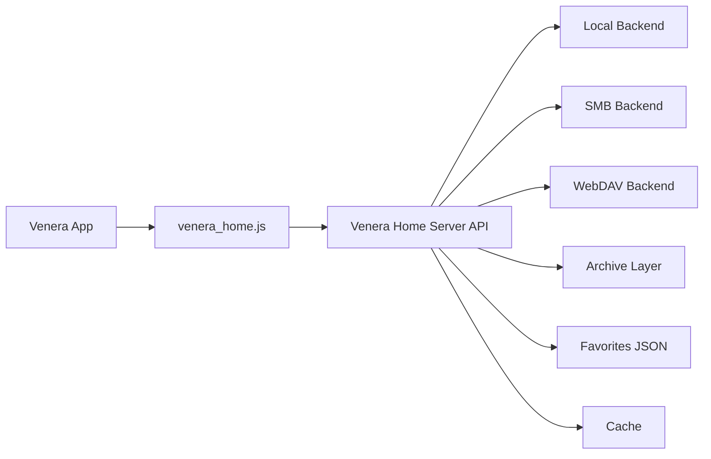

# Venera Home Server

[中文](./README.md) | [English](./README_EN.md)

`Venera Home Server` 是一个为 **[Venera](https://github.com/venera-app/venera)** 漫画阅读器准备的本地漫画后端。它把本地磁盘、SMB 共享、WebDAV 里的漫画统一暴露成轻量 HTTP API，并配套提供可直接导入 Venera 的 `venera_home.js`。

## 项目目标

- 让 [Venera](https://github.com/venera-app/venera) 直接阅读你已经拥有的本地漫画
- 把文件系统、归档读取、缓存、元数据处理沉到独立服务端
- 保持 `venera_home.js` 尽量薄，主要负责 API 映射
- 优先覆盖离线 / 私有漫画库场景，为后续扩展留空间

## 当前能力

### 书库来源

- 本地目录
- SMB 共享（当前仅 Windows 实现）
- WebDAV

### 支持格式

- 图片目录：`jpg` / `jpeg` / `png` / `webp` / `gif` / `bmp` / `avif`
- ZIP 类压缩包：`cbz` / `zip`
- RAR 类压缩包：`cbr` / `rar`
- 7-Zip：`cb7` / `7z`
- 文档：`pdf`（当前仅 Windows 渲染）

### 功能

- 扫描、索引、首页、分类、搜索、详情、章节阅读
- 收藏夹与多文件夹收藏
- `ComicInfo.xml` 读取
- `.venera.json` 手工覆盖元数据
- 归档与远程文件缓存
- PDF 首次访问按页渲染并缓存
- 手动重扫
- 带签名的封面 / 页面媒体 URL

## 当前限制

- `SMB` 当前只在 Windows 构建中可用
- `PDF` 当前只在 Windows 构建中可用，依赖系统内建 `Windows.Data.Pdf`
- 还没有实现远程元数据抓取
- 还没有 Web 管理界面
- 还没有评论、签到、账号体系等互联网源能力

## 目录结构

- `main.go`：项目唯一入口，便于直接 `go run .`
- `app/`：核心应用模型、扫描与元数据合并
- `httpapi/`：HTTP API、媒体分发与页面缓存
- `backend/` / `archive/`：存储后端与归档访问
- `tests/`：独立测试模块，按模块拆分
- `venera_home.js`：[Venera](https://github.com/venera-app/venera) 源脚本
- `server.example.toml`：示例配置
- `openapi.yaml`：HTTP API 草案 / 合同

## 模块说明

当前服务端采用根目录扁平模块结构：

- `app/`：核心应用模型、扫描、元数据合并、章节分页物化
- `archive/`：ZIP / RAR / 7Z / PDF 归档访问
- `backend/`：本地、SMB、WebDAV 存储后端
- `config/`：配置加载与解析
- `favorites/`：收藏夹持久化
- `httpapi/`：HTTP 路由、媒体分发、页面缓存逻辑
- `shared/`：跨模块复用工具
- `tests/`：独立测试模块与 `testkit/` 公共测试支撑

这套结构的目标：

1. 根目录直接按模块分类，避免额外层级；
2. `main.go` 保持为唯一启动入口；
3. 测试目录独立，便于按模块浏览与维护。

## 架构概览



## 快速开始

### 1. 准备配置

从下面文件复制一份并修改：

- `server.example.toml`

最小本地示例：

```toml
[server]
listen = "0.0.0.0:34123"
token = "change-me"
data_dir = "./data"
cache_dir = "./cache"
log_level = "info"

[scan]
concurrency = 4
extract_archives = true
watch_local = false
rescan_interval_minutes = 30

[metadata]
read_comicinfo = true
read_sidecar = true
allow_remote_fetch = false

[[libraries]]
id = "local-main"
name = "Local Manga"
kind = "local"
root = "D:/Comics"
scan_mode = "auto"
```

- `log_level` 默认是 `info`；若要看页面缓存、预取、压缩等调试日志，可改成 `debug`
- `scan_mode` 支持两种模式：
  - `auto`：默认模式；只有同层项目的显式元数据能匹配上时，才会合并成同一漫画的多个章节
  - `flat`：不自动合并同层项目；每个压缩包或图片目录都按独立漫画处理

### 2. 如果使用 SMB / WebDAV，先设置密码环境变量

```powershell
$env:SMB_PASS = "your-password"
$env:WEBDAV_PASS = "your-password"
```

### 3. 启动服务

开发模式：

```powershell
go run . -config ./server.example.toml
```

如果你已经有编译好的可执行文件，也可以直接运行：

```powershell
.\venera_home_server.exe -config .\server.example.toml
```

### 4. 在 [Venera](https://github.com/venera-app/venera) 中导入源脚本

导入：

- `venera_home.js`

然后填写：

- `Server URL`：例如 `http://127.0.0.1:34123` 或 `http://192.168.1.20:34123`
- `Token`：与配置文件里的 `token` 保持一致
- `Default Library ID`：可留空，也可以指定某个书库
- `Default Sort`
- `Page Size`

> 如果是手机访问电脑上的服务，不要填 `127.0.0.1`，要填电脑的局域网 IP。

## 书库结构建议

### 单本漫画目录

```text
D:\Comics\Bocchi The Rock\
  001.jpg
  002.jpg
  003.jpg
```

### 多章节目录

```text
D:\Comics\Dungeon Meshi\
  01\
    001.jpg
    002.jpg
  02\
    001.jpg
    002.jpg
```

### 单文件漫画

```text
D:\Comics\Packed\
  monster.cbz
  legacy.cbr
  packed.cb7
  album.pdf
```

同层的多个章节目录 / 压缩包，只有在 `scan_mode = "auto"` 且显式元数据匹配时，才会被识别成同一漫画下的不同章节。

如果一个压缩包内部包含多个顶层图片文件夹，则默认识别为多章节漫画。

如果你的目录只是“月份桶 / 作者桶 / 临时归档桶”，不想自动合卷，可以：

- 把对应书库的 `scan_mode` 改成 `flat`
- 或者只在某个目录里放一份 `.venera.json`，内容写成 `{ "scan_mode": "flat" }` 做目录级覆盖

## 元数据优先级

服务端当前按下面顺序取元数据：

1. `.venera.json`
2. `ComicInfo.xml`
3. 文件名 / 目录名推断

`.venera.json` 示例：

```json
{
  "title": "Chapter 01",
  "series": "Dungeon Meshi",
  "subtitle": "Ryoko Kui",
  "description": "Hand-maintained metadata",
  "authors": ["Ryoko Kui"],
  "tags": ["Fantasy", "Adventure", "Food"],
  "language": "zh",
  "scan_mode": "flat"
}
```

## 平台说明

### Windows

- 推荐平台
- 支持本地、SMB、WebDAV
- 支持 PDF 渲染

### Linux / macOS

- 支持本地、WebDAV
- 当前不支持 SMB
- 当前不支持 PDF 渲染
- 其余图片 / ZIP / RAR / 7-Zip 流程仍可用

## 开发与测试

运行测试：

```powershell
go test -buildvcs=false ./...
```

当前测试覆盖包括：

- 配置加载
- 本地完整流程
- WebDAV 扫描
- 元数据覆盖
- `rar` / `7z` 归档读取
- `pdf` 阅读流程（Windows）

## API 与实现说明

- HTTP API 草案：`openapi.yaml`
- 服务端核心实现：`app/` + `httpapi/` + `backend/` + `archive/`
- [Venera](https://github.com/venera-app/venera) 源脚本：`venera_home.js`

`venera_home.js` 设计上保持较薄，主要负责请求 `/api/v1/*` 接口，并把返回数据转换为 [Venera](https://github.com/venera-app/venera) 可识别的数据结构。

## 后续方向

- 更完整的中文 / 英文设置说明
- 更好的发布包结构（exe + 默认配置 + 启动脚本）
- 远程元数据抓取与人工修正界面
- 跨平台 PDF 方案
- 更细粒度的缓存与预热策略
