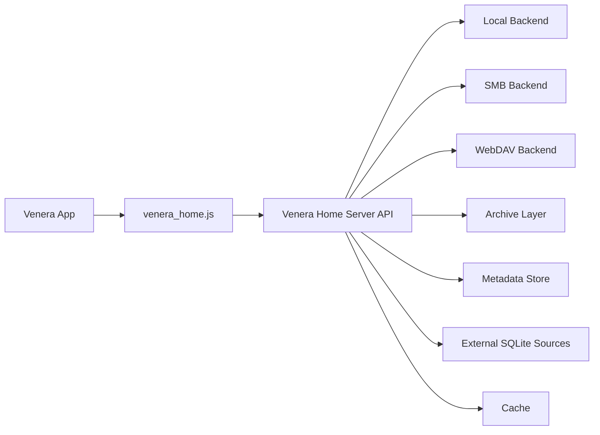

# Venera Home Server

[中文](./README.md) | [English](./README_EN.md)

`Venera Home Server` is a local-comics backend for **[Venera](https://github.com/venera-app/venera)**. It exposes comics stored on local disks, SMB shares, or WebDAV through a lightweight HTTP API, and ships with a matching `venera_home.js` source script that can be imported into Venera directly.

The current version also includes a **manual-triggered, auto-apply** metadata enrichment flow:

- scan comics into a local metadata store
- auto-discover external SQLite sources from `data/externaldb`
- trigger enrichment manually from the built-in web admin page
- write matched metadata back into the local store automatically
- run a final `Rescan` so Venera sees the result immediately

## Goals

- Let [Venera](https://github.com/venera-app/venera) read comics you already own
- Move filesystem, archive, cache, and metadata logic into a standalone server
- Keep `venera_home.js` thin and focused on API mapping
- Start with offline / private-library workflows while leaving room for more metadata providers later

## What It Supports

### Library backends

- Local directories
- SMB shares (currently Windows-only)
- WebDAV

### Comic formats

- Image folders: `jpg` / `jpeg` / `png` / `webp` / `gif` / `bmp` / `avif`
- ZIP-based archives: `cbz` / `zip`
- RAR-based archives: `cbr` / `rar`
- 7-Zip archives: `cb7` / `7z`
- Documents: `pdf` (currently rendered on Windows only)

### Reading and serving features

- Scan, index, home feed, categories, search, details, chapter reading
- Favorites with multiple folders
- `ComicInfo.xml` support
- `.venera.json` sidecar metadata overrides
- Local cache for archives and remote files
- Cached page rendering for PDF on first access
- Manual rescan endpoint
- Signed media URLs for covers and pages
- `venera_home.js` details can show local and relative paths

### Metadata features

- Persistent local metadata store in `metadata.db`
- Stored scan hints, paths, and content fingerprints
- Fill-only metadata merge: enrichment does not overwrite explicit local metadata
- External SQLite metadata enrichment
- Dry-run matcher tool: `exdb_dryrun`
- Admin actions from the web UI:
  - manual batch enrichment
  - single-record retry
  - multi-select batch lock / unlock / reset / re-enrich
  - browse external data sources

### Built-in web admin

The root path `/` is now a built-in admin page.

It currently supports:

- viewing job progress
- querying local metadata records, including `state=locked` filtering
- triggering manual enrichment jobs
- browsing external sources under `data/externaldb`
- locking, unlocking, resetting, and re-enriching a single record
- batch lock / unlock / reset / re-enrich on selected records from the current page

## Current Limitations

- `SMB` is only implemented in Windows builds
- `PDF` rendering is only available on Windows builds and depends on `Windows.Data.Pdf`
- Current enrichment providers are **local SQLite databases** only; internet metadata sources are not integrated yet
- There is no scheduled automation yet; enrichment is manual by design for now
- There is no advanced review workflow yet; the current goal is “trigger once manually, fix edge cases in the web UI”

## Repository Layout

- `main.go`: single project entry for `go run .`
- `app/`: core application model, scan flow, metadata merge, and enrichment jobs
- `httpapi/`: HTTP API, media serving, admin UI, and page-cache logic
- `metadata/`: local metadata store and queries
- `exdbdryrun/`: external SQLite matcher and dry-run logic
- `backend/` / `archive/`: storage backends and archive access
- `tests/`: standalone test modules plus `testkit/`
- `venera_home.js`: [Venera](https://github.com/venera-app/venera) source script
- `server.example.toml`: example configuration
- `openapi.yaml`: API contract / draft

## Architecture Overview



## Quick Start

### 1. Prepare the config

Start from:

- `server.example.toml`

Minimal local-library example:

```toml
[server]
listen = "0.0.0.0:34123"
token = "change-me"
data_dir = "./data"
cache_dir = "./cache"
memory_cache_mb = 512
log_level = "info"

[scan]
concurrency = 4
extract_archives = true
watch_local = false
rescan_interval_minutes = 30

[metadata]
read_comicinfo = true
read_sidecar = true
allow_remote_fetch = false

[[libraries]]
id = "local-main"
name = "Local Manga"
kind = "local"
root = "D:/Comics"
scan_mode = "auto"
```

Notes:

- `log_level` defaults to `info`; switch to `debug` if you want cache, prefetch, and scan details
- `scan_mode`:
  - `auto`: default; sibling folders / archives are grouped only when explicit metadata matches
  - `flat`: do not auto-group sibling items; each folder or archive is treated as a separate comic
- `allow_remote_fetch` currently exists mainly as a future-facing flag for internet providers

### 2. Set secret env vars for SMB / WebDAV if needed

```powershell
$env:SMB_PASS = "your-password"
$env:WEBDAV_PASS = "your-password"
```

### 3. Start the server

Development mode:

```powershell
go run . -config ./server.example.toml
```

If you already have a built binary:

```powershell
.\venera_home_server.exe -config .\server.example.toml
```

### 4. Import the Venera source script

Import:

- `venera_home.js`

Then configure:

- `Server URL`: for example `http://127.0.0.1:34123`
- `Token`: must match the server config
- `Default Library ID`: optional
- `Default Sort`
- `Page Size`
- `Image Mode`

> If your phone is connecting to a PC-hosted server, do not use `127.0.0.1`; use the PC's LAN IP instead.

## Metadata Enrichment Workflow

### 1. Scan into the local metadata store

Every scan writes comic records into the local metadata database, which defaults to:

- `data/metadata.db`

The store keeps:

- stable comic locator info
- folder paths
- content fingerprints
- matching hints (keywords, EH-style hints, etc.)
- enriched titles, artists, tags, source IDs, and related metadata

### 2. Drop external databases into place

Put your external SQLite files directly into:

- `data/externaldb/`

No extra source registration is required. The server discovers them automatically in the admin UI.

### 3. Trigger enrichment manually from the web UI

Open:

- `/`

If your server uses a token, enter the Bearer token in the upper-right corner.

Typical flow:

- browse a source first to confirm the data looks correct
- trigger a batch enrichment job for `state=empty`
- use `state=locked` in the records view to find already locked items quickly
- select multiple records on the current page for batch lock / unlock / reset / re-enrich
- wait for the job to finish
- the server auto-applies matches and performs a final `Rescan`

### 4. Handle bad matches or unsupported books

If one book is matched incorrectly, or a source simply does not cover it yet:

- use **Reset to local** to clear enriched fields
- use **Lock** to exclude it from future batch enrichment
- unlock and retry later when you have better sources

This is what the `manual_locked` field is for: **prevent the same bad enrichment from being applied repeatedly**.

## `exdb_dryrun` Usage

If you want to inspect matching quality before using a database in the server, use the dry-run tool.

Example:

```powershell
.\exdb_dryrun.exe `
  -metadata D:\test\data\metadata.db `
  -exdb H:\Downloads\2025_08_04_database.sqlite `
  -library local-main `
  -state empty `
  -limit 200 `
  -min-score 0.72 `
  -out H:\Downloads\report.json
```

Typical uses:

- evaluate whether an external database is worth using
- tune `min-score`
- compare hit quality across databases
- inspect obvious false positives before enabling a source in practice

## Metadata Priority

Metadata is currently resolved in roughly this order:

1. `.venera.json`
2. `ComicInfo.xml`
3. filename / folder-name inference
4. enriched fields from the local metadata store (fill-only, not destructive overwrite)

Example `.venera.json`:

```json
{
  "title": "Chapter 01",
  "series": "Dungeon Meshi",
  "subtitle": "Ryoko Kui",
  "description": "Hand-maintained metadata",
  "authors": ["Ryoko Kui"],
  "tags": ["Fantasy", "Adventure", "Food"],
  "language": "zh",
  "scan_mode": "flat"
}
```

Additional behavior:

- `hidden: true`: ignore the current directory or archive
- For archive files, you can place `xxx.cbz.venera.json` / `xxx.zip.venera.json` next to the archive

## Recommended Library Layout

### Single-book folder

```text
D:\Comics\Bocchi The Rock\
  001.jpg
  002.jpg
  003.jpg
```

### Multi-chapter series

```text
D:\Comics\Dungeon Meshi\
  01\
    001.jpg
    002.jpg
  02\
    001.jpg
    002.jpg
```

### Single-file comics

```text
D:\Comics\Packed\
  monster.cbz
  legacy.cbr
  packed.cb7
  album.pdf
```

## Platform Notes

### Windows

- Recommended platform
- Supports local, SMB, and WebDAV
- Supports PDF rendering

### Linux / macOS

- Supports local and WebDAV
- SMB is not implemented yet
- PDF rendering is not implemented yet
- Image / ZIP / RAR / 7-Zip flows still work

## Development and Tests

Run tests with:

```powershell
go test ./...
```

Build with:

```powershell
go build ./...
```

Current coverage includes:

- config loading
- end-to-end local reading flow
- WebDAV scan flow
- metadata override and enrichment flow
- `rar` / `7z` archive reading
- admin metadata endpoints

## Roadmap

- More local and internet metadata providers
- Better diff / review tools for metadata corrections
- Scheduled automation jobs
- Richer admin-page statistics and filters
- Cross-platform PDF support
