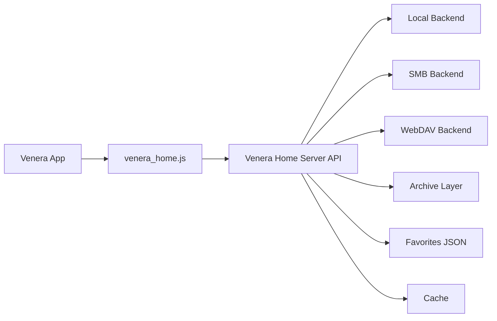

# Venera Home Server

[娑擃厽��./README.md) | [English](./README_EN.md)

`Venera Home Server` is a local-comics backend for **Venera**. It exposes comics stored on local disks, SMB shares, or WebDAV as a lightweight HTTP API, and ships with a matching `venera_home.js` source script that can be imported into Venera directly.

## Goals

- Let Venera read comics you already own
- Move filesystem, archive, cache, and metadata logic into a standalone server
- Keep `venera_home.js` thin and focused on API mapping
- Start with offline / private-library workflows, while leaving room for future online metadata features

## What It Supports

### Library backends

- Local directories
- SMB shares (currently Windows-only)
- WebDAV

### Comic formats

- Image folders: `jpg` / `jpeg` / `png` / `webp` / `gif` / `bmp` / `avif`
- ZIP-based archives: `cbz` / `zip`
- RAR-based archives: `cbr` / `rar`
- 7-Zip archives: `cb7` / `7z`
- Documents: `pdf` (currently rendered on Windows only)

### Features

- Scan, index, home feed, categories, search, details, chapter reading
- Favorites with multiple folders
- `ComicInfo.xml` support
- `.venera.json` sidecar metadata overrides
- Local cache for archives and remote files
- Cached page rendering for PDF on first access
- Manual rescan endpoint
- Signed media URLs for covers and pages

## Current Limitations

- `SMB` is only implemented in Windows builds
- `PDF` rendering is only available on Windows builds and depends on `Windows.Data.Pdf`
- Remote metadata fetching is not implemented yet
- No web admin UI yet
- No internet-source features such as comments, sign-in, or account flows

## Repository Layout

- `main.go`: server entry point
- `venera_home.js`: Venera source script
- `server.example.toml`: example configuration
- `openapi.yaml`: API contract / draft
- `archive.go`: shared archive abstraction layer
- `archive_pdf_windows.go`: Windows PDF renderer
- `testdata/`: archive fixtures used by tests

## Architecture Overview



## Quick Start

### 1. Prepare the config

Start from:

- `server.example.toml`

Minimal local-library example:

```toml
[server]
listen = "0.0.0.0:34123"
token = "change-me"
data_dir = "./data"
cache_dir = "./cache"

[scan]
concurrency = 4
extract_archives = true
watch_local = false
rescan_interval_minutes = 30

[metadata]
read_comicinfo = true
read_sidecar = true
allow_remote_fetch = false

[[libraries]]
id = "local-main"
name = "Local Manga"
kind = "local"
root = "D:/Comics"
scan_mode = "auto"
```

`scan_mode` supports two modes:

- `auto`: default; sibling chapter folders or archives are grouped only when explicit metadata matches (for example the same `Series`, or the same explicit title without conflicts)
- `flat`: do not auto-group sibling items; each archive or image folder is treated as a separate comic

### 2. Set secret env vars for SMB / WebDAV if needed

```powershell
$env:SMB_PASS = "your-password"
$env:WEBDAV_PASS = "your-password"
```

### 3. Start the server

Development mode:

```powershell
go run . -config .\server.example.toml
```

If you already have a built binary:

```powershell
.\venera_home_server.exe -config .\server.example.toml
```

### 4. Import the Venera source

Import:

- `venera_home.js`

Then configure:

- `Server URL`: for example `http://127.0.0.1:34123` or `http://192.168.1.20:34123`
- `Token`: must match the server config
- `Default Library ID`: optional
- `Default Sort`
- `Page Size`

> If your phone is connecting to a PC-hosted server, do not use `127.0.0.1`; use the PC's LAN IP instead.

## Recommended Library Layout

### Single-book folder

```text
D:\Comics\Bocchi The Rock\
  001.jpg
  002.jpg
  003.jpg
```

### Multi-chapter series

```text
D:\Comics\Dungeon Meshi\
  01\
    001.jpg
    002.jpg
  02\
    001.jpg
    002.jpg
```

### Single-file comics

```text
D:\Comics\Packed\
  monster.cbz
  legacy.cbr
  packed.cb7
  album.pdf
```

Multiple chapter folders or archives inside the same folder are grouped as chapters of one comic only when their explicit metadata matches in `scan_mode = "auto"`.

A single archive that contains multiple top-level image folders is treated as a multi-chapter comic by default.

If a folder is only a month bucket, author bucket, or temporary archive bucket and you do not want auto-grouping, you can:

- set the library `scan_mode` to `flat`
- or drop a `.venera.json` into that folder with `{ "scan_mode": "flat" }` to override just that directory

## Metadata Priority

Metadata is currently resolved in this order:

1. `.venera.json`
2. `ComicInfo.xml`
3. Filename / folder-name inference

Example `.venera.json`:

```json
{
  "title": "Chapter 01",
  "series": "Dungeon Meshi",
  "subtitle": "Ryoko Kui",
  "description": "Hand-maintained metadata",
  "authors": ["Ryoko Kui"],
  "tags": ["Fantasy", "Adventure", "Food"],
  "language": "zh",
  "scan_mode": "flat"
}
```

## Platform Notes

### Windows

- Recommended platform
- Supports local, SMB, and WebDAV
- Supports PDF rendering

### Linux / macOS

- Supports local and WebDAV
- SMB is not implemented yet
- PDF rendering is not implemented yet
- Image / ZIP / RAR / 7-Zip flows still work

## Development and Tests

Run tests with:

```powershell
go test -buildvcs=false ./...
```

Current test coverage includes:

- config loading
- end-to-end local flow
- WebDAV scan flow
- metadata override behavior
- `rar` / `7z` archive reading
- `pdf` reading flow on Windows

## API and Implementation Notes

- API contract: `openapi.yaml`
- Archive abstraction entry: `archive.go`
- Venera source script: `venera_home.js`

The source script is intentionally thin. Most complexity lives on the server side, while `venera_home.js` mainly maps `/api/v1/*` responses into Venera-compatible objects.

## Roadmap

- Better Chinese / English setup docs inside the source UI
- Cleaner release packaging (exe + default config + startup scripts)
- Remote metadata fetching and manual correction UI
- Cross-platform PDF support
- More granular cache and prewarm controls